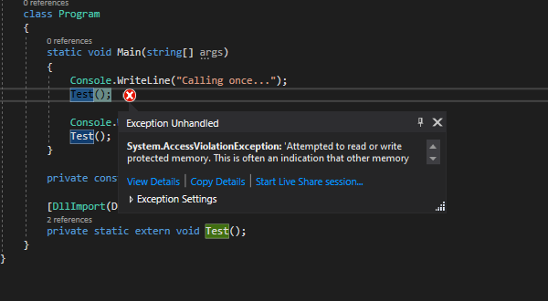

# CSharp/C Interop Problem
While attempting to use [VOLK](https://github.com/gnuradio/volk) with CSharp, I ran into a problem related to rewriting function pointers and calling them from CSharp. In CSharp, ``DllImport``ing and then calling one of these 
function pointers results in a ``System.AccessViolationException`` being thrown.  This simple example demonstrates the issue. The C DLL, compiled with mingw32, cannot be used in CSharp as a 
result of this issue. Everything in here is already built and ready to be tested.
## Testing for Yourself
Precompiled binaries are supplied, but if you'd like to rebuild them yourself, run ``build.sh`` to build the C binary and use ``dotnet build`` in the ``CSharpVolkBugTest`` directory to compile the CSharp binary. From there, run 
``CSharpVolkBugTest/bin/Debug/netcoreapp3.1/CSharpVolkBugTest.exe``.
## C Compiler Details
* C DLL is built under Linux, but for usage on Windows * MingW32 version: ``x86_64-w64-mingw32-g++ (GCC) 7.3-win32 20180312`` * Ubuntu version: ``Ubuntu 18.04.4 LTS``
* System details: ``Intel Pentium 4 CPU``
